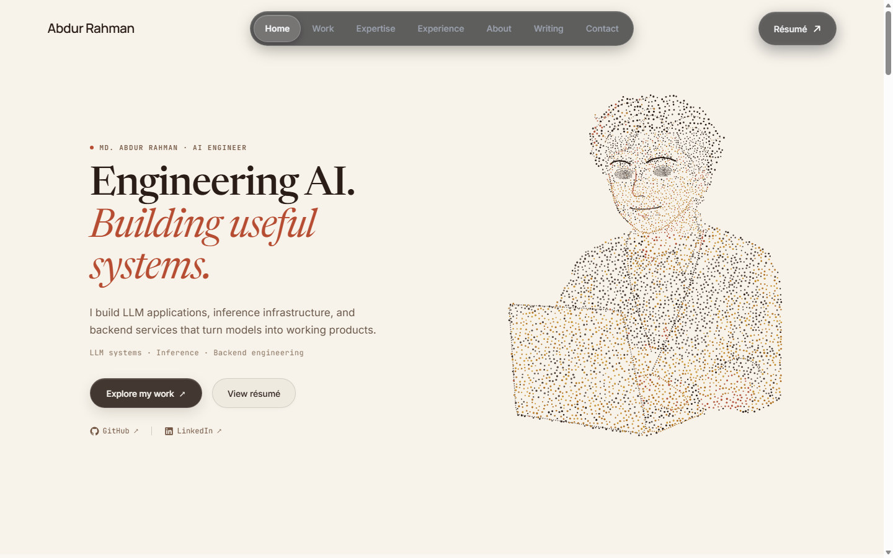

# Md. Abdur Rahman - Portfolio & AI Admin Copilot 🚀

Welcome to the source code for my professional AI Engineering portfolio. This repository houses a fully custom, high-performance web portfolio featuring an interactive SVG particle hero, a dynamic writing/blog section.



## ✨ Key Features

- **Interactive SVG Particle Hero**: A lightweight, dependency-free animated hero section that responds to user interaction without relying on heavy canvas libraries.
- **Single Source of Truth (JSON Architecture)**: All site data is structured cleanly in `content/*.json` files, which compile down to blazing-fast static HTML.
- **Zero-Dependency Frontend**: Built with modern semantic HTML, vanilla CSS, and vanilla JavaScript for maximum performance and accessibility.
- **Automated Resume Sync**: Upload a new `resume.pdf` via the dashboard to instantly sync the downloadable file and embedded PDF viewer.

## 🛠️ Tech Stack

- **Frontend**: HTML5, Vanilla CSS, Vanilla JavaScript
- **Data Storage**: JSON (`/content/`)
- **Hosting**: GitHub Pages (Static generation)

---

## 🚀 Getting Started

### 1. View the Live Site
Since this is a static site, you can view the frontend by simply opening `index.html` in your browser, or by serving it locally:
```bash
python -m http.server 8080
# Open http://localhost:8080
```


### 2. Rebuild the Site
Whenever you update content via the dashboard or manually edit the JSON files in `/content/`, you must rebuild the static HTML:
```bash
python tools/build_site.py
```


---

## 📂 Project Structure

```text
├── content/              # 🧠 Single Source of Truth: JSON data for projects, blogs, experience
├── assets/               # 🖼️ Images, SVGs, and other media
├── tools/                # 🧰 Build scripts (build_site.py, verification tools)
├── writing/              # 📝 Compiled blog & writing pages
├── resume/               # 📄 Custom Resume viewer experience
├── index.html            # 🏠 Main portfolio page
├── hero.css / .js        # ✨ Interactive SVG hero logic
└── dot-art.css / .js     # 🎨 Interactive dot portrait logic
```

## 📜 Advanced / Technical Documentation

<details>
<summary><strong>Click to expand technical notes on the Hero & Interactive Portrait</strong></summary>

### Interactive Dot Portrait
- Lives in `dot-art.html`. Embedded in the About section of `index.html`.
- 5,200 static dots on desktop, 2,600 on mobile. Uses SVG coordinates instead of canvas for accessibility and performance.
- Motion handles entrance animations and ripple effects on click. Obeys OS reduced-motion preferences.

### Build and Verification Scripts
- `python tools/build-dot-art.py`: Recreates the SVG artwork from PNG samples.
- `node tools/verify-dot-art.mjs`: Headless Chrome tests for accessibility, responsiveness, and performance limits.
- `python tools/verify.py`: Playwright regression checks for the interactive hero.
</details>

---
*Built with ❤️ and AI.*
